# Awesome Design Skills [](https://awesome.re)


<br>

> A curated registry of 67 design system skill files for AI-powered agentic tools like [Claude Code](https://docs.anthropic.com/en/docs/agents-and-tools/claude-code/overview), [Cursor](https://www.cursor.com/), [Codex](https://openai.com/index/codex/), and others. Pull any skill into your project with a single command.

Each skill now ships as a folder with:
- `SKILL.md` for AI-agent instructions (tokens, component rules, accessibility constraints, quality gates)
- `DESIGN.md` for human-readable design intent, rationale, and implementation notes

**[Preview all design skills on Type UI](https://typeui.sh/design-skills)**

## Quick Start

Pull any design skill directly into your project using the [TypeUI CLI](https://github.com/bergside/typeui.sh):

```bash
npx typeui.sh pull <slug>
```

For example, to pull the Glassmorphism design skill:

```bash
npx typeui.sh pull glassmorphism
```

Or browse all available skills interactively:

```bash
npx typeui.sh list
```

## What is a Design Skill?

A design skill is a folder containing `SKILL.md` and `DESIGN.md`.

`SKILL.md` acts as the instruction source for AI agents and LLMs. It contains:

- **Brand & mission** — the design philosophy and visual identity
- **Style foundations** — typography scale, color palette, spacing system
- **Component families** — buttons, inputs, cards, modals, navigation, and more
- **Accessibility rules** — WCAG 2.2 AA compliance, keyboard-first interactions
- **Writing tone** — content and voice guidelines
- **Do/Don't rules** — explicit patterns and anti-patterns
- **Quality gates** — testable acceptance criteria for code review

`DESIGN.md` is a companion document for human readers and maintainers. It captures:

- **Design overview** — concise summary of the visual direction
- **Rationale and references** — context for why patterns/tokens exist
- **Maintenance notes** — guidance for keeping design decisions aligned over time

When an AI agent reads a skill file, it follows the `SKILL.md` guidelines to generate UI code that is consistent, accessible, and true to the design system.

## Design Skills

Browse all **67** design skills. Click any thumbnail to open the live preview on [typeui.sh/design-skills](https://typeui.sh/design-skills), or copy the pull command underneath to add the skill to your project.

<table>
  <tr>
    <td align="center" width="33%" valign="top">
      <a href="https://typeui.sh/design-skills/agentic">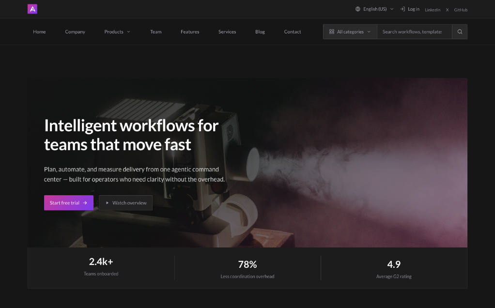</a><br />
      <a href="https://typeui.sh/design-skills/agentic"><b>Agentic</b></a><br />
      <sub><code>npx typeui.sh pull agentic</code></sub>
    </td>
    <td align="center" width="33%" valign="top">
      <a href="https://typeui.sh/design-skills/ant">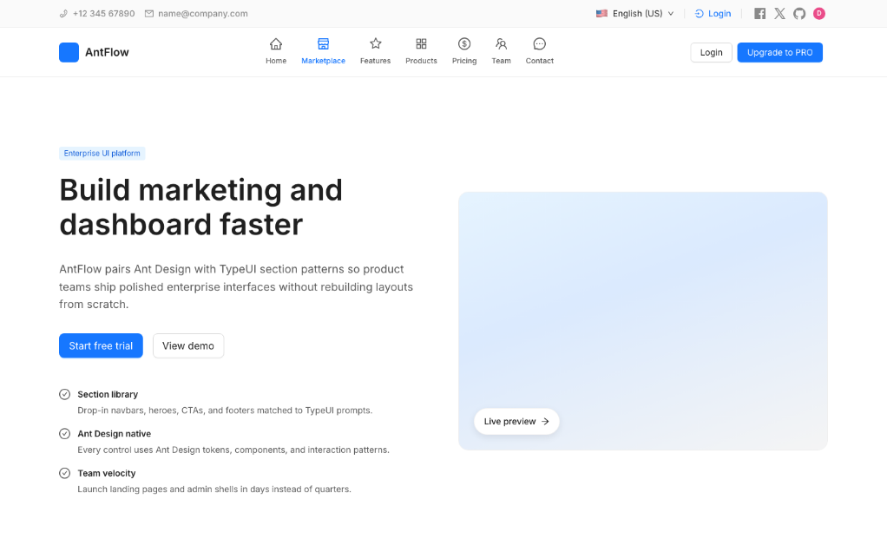</a><br />
      <a href="https://typeui.sh/design-skills/ant"><b>Ant</b></a><br />
      <sub><code>npx typeui.sh pull ant</code></sub>
    </td>
    <td align="center" width="33%" valign="top">
      <a href="https://typeui.sh/design-skills/roku">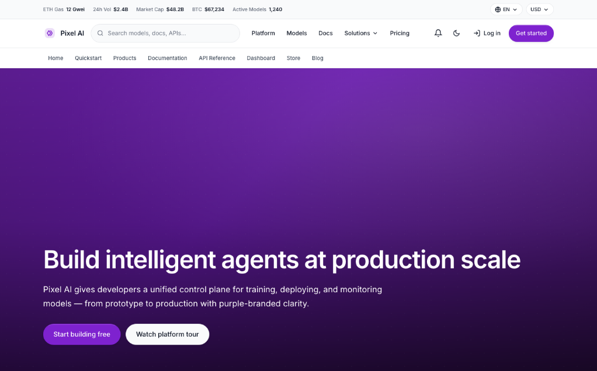</a><br />
      <a href="https://typeui.sh/design-skills/roku"><b>Roku</b></a><br />
      <sub><code>npx typeui.sh pull roku</code></sub>
    </td>
  </tr>
  <tr>
    <td align="center" width="33%" valign="top">
      <a href="https://typeui.sh/design-skills/artistic">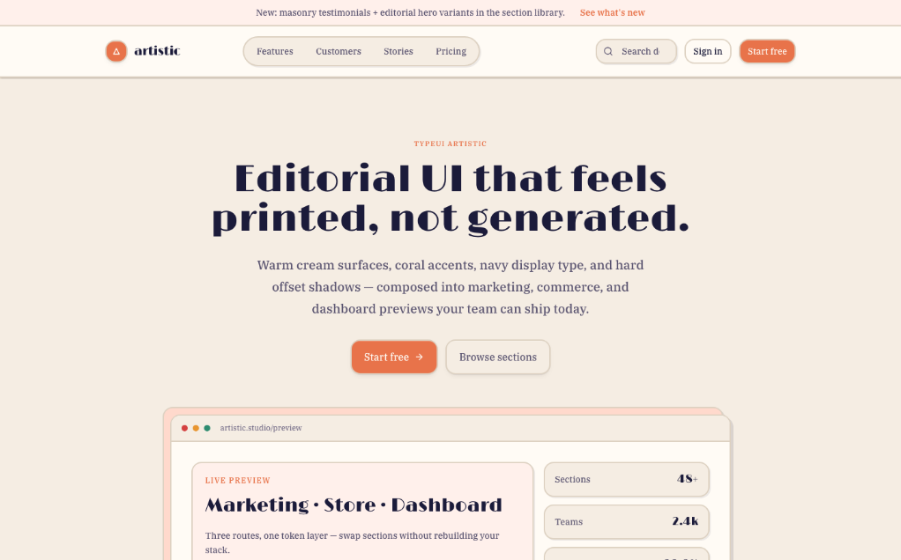</a><br />
      <a href="https://typeui.sh/design-skills/artistic"><b>Artistic</b></a><br />
      <sub><code>npx typeui.sh pull artistic</code></sub>
    </td>
    <td align="center" width="33%" valign="top">
      <a href="https://typeui.sh/design-skills/bento"></a><br />
      <a href="https://typeui.sh/design-skills/bento"><b>Bento</b></a><br />
      <sub><code>npx typeui.sh pull bento</code></sub>
    </td>
    <td align="center" width="33%" valign="top">
      <a href="https://typeui.sh/design-skills/bold">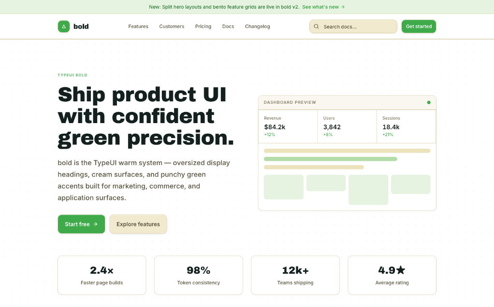</a><br />
      <a href="https://typeui.sh/design-skills/bold"><b>Bold</b></a><br />
      <sub><code>npx typeui.sh pull bold</code></sub>
    </td>
  </tr>
  <tr>
    <td align="center" width="33%" valign="top">
      <a href="https://typeui.sh/design-skills/brutalism">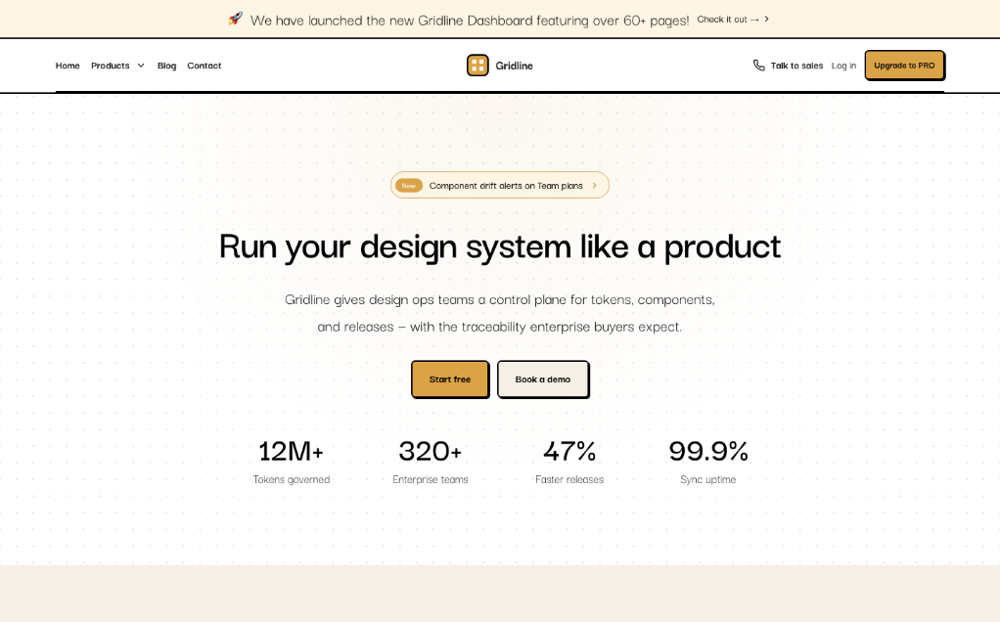</a><br />
      <a href="https://typeui.sh/design-skills/brutalism"><b>Brutalism</b></a><br />
      <sub><code>npx typeui.sh pull brutalism</code></sub>
    </td>
    <td align="center" width="33%" valign="top">
      <a href="https://typeui.sh/design-skills/cafe">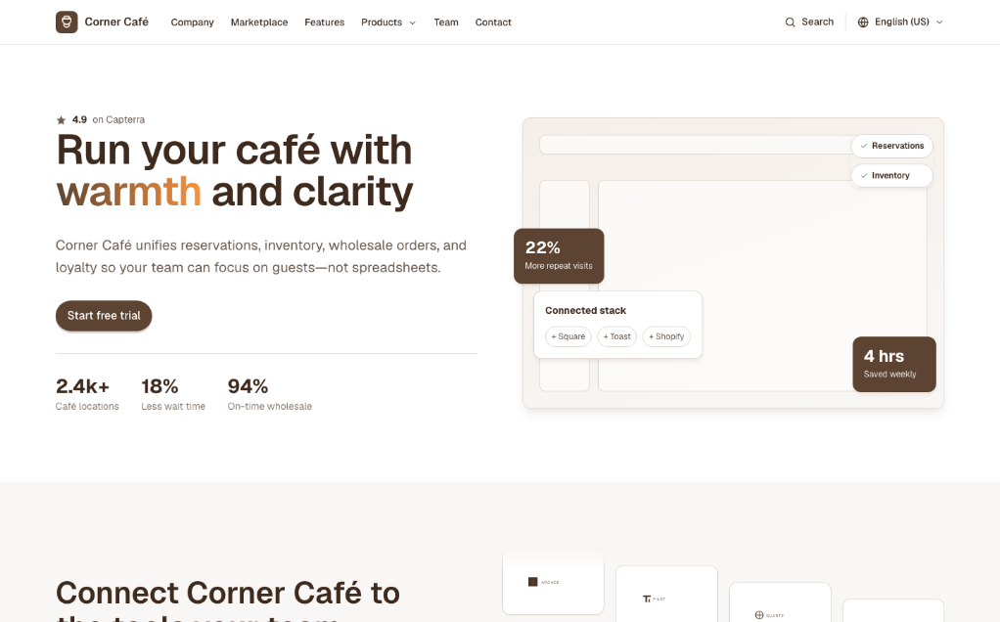</a><br />
      <a href="https://typeui.sh/design-skills/cafe"><b>Cafe</b></a><br />
      <sub><code>npx typeui.sh pull cafe</code></sub>
    </td>
    <td align="center" width="33%" valign="top">
      <a href="https://typeui.sh/design-skills/claymorphism">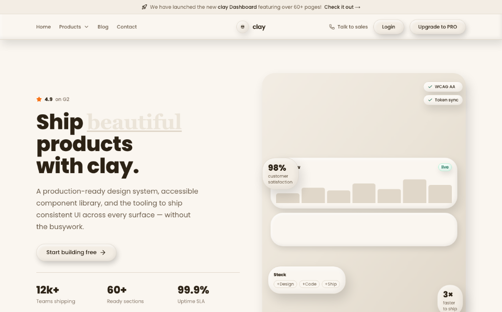</a><br />
      <a href="https://typeui.sh/design-skills/claymorphism"><b>Claymorphism</b></a><br />
      <sub><code>npx typeui.sh pull claymorphism</code></sub>
    </td>
  </tr>
  <tr>
    <td align="center" width="33%" valign="top">
      <a href="https://typeui.sh/design-skills/claude">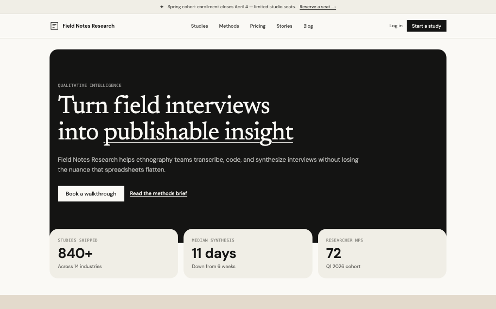</a><br />
      <a href="https://typeui.sh/design-skills/claude"><b>Claude</b></a><br />
      <sub><code>npx typeui.sh pull claude</code></sub>
    </td>
    <td align="center" width="33%" valign="top">
      <a href="https://typeui.sh/design-skills/clean">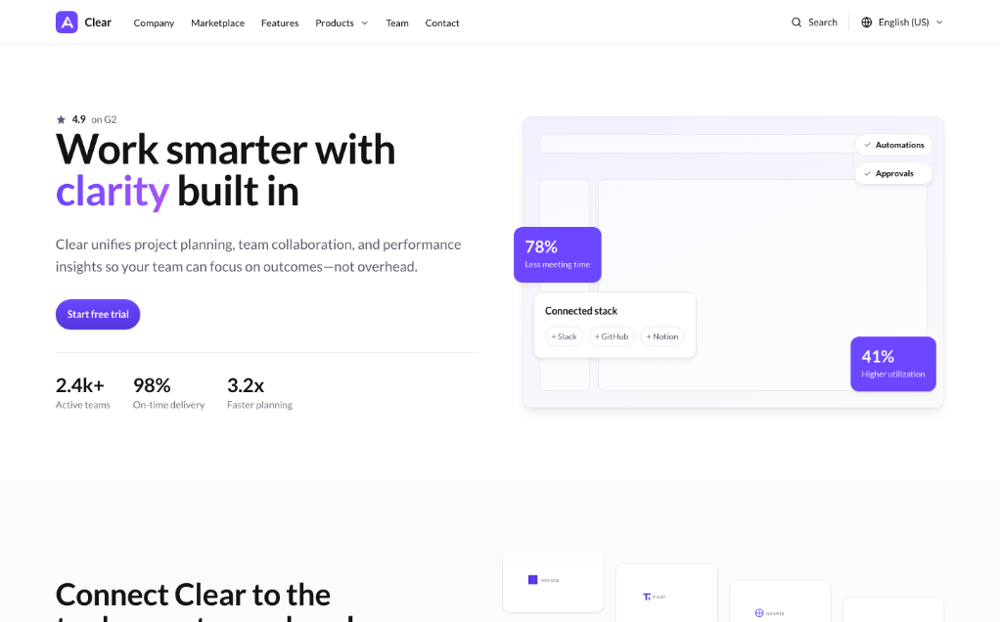</a><br />
      <a href="https://typeui.sh/design-skills/clean"><b>Clean</b></a><br />
      <sub><code>npx typeui.sh pull clean</code></sub>
    </td>
    <td align="center" width="33%" valign="top">
      <a href="https://typeui.sh/design-skills/codex">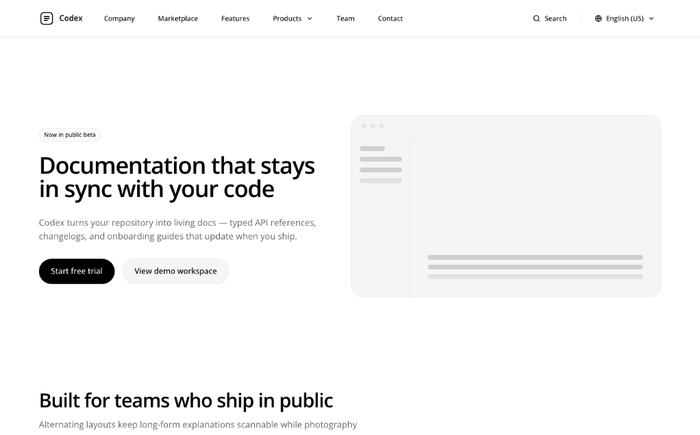</a><br />
      <a href="https://typeui.sh/design-skills/codex"><b>Codex</b></a><br />
      <sub><code>npx typeui.sh pull codex</code></sub>
    </td>
  </tr>
  <tr>
    <td align="center" width="33%" valign="top">
      <a href="https://typeui.sh/design-skills/colorful">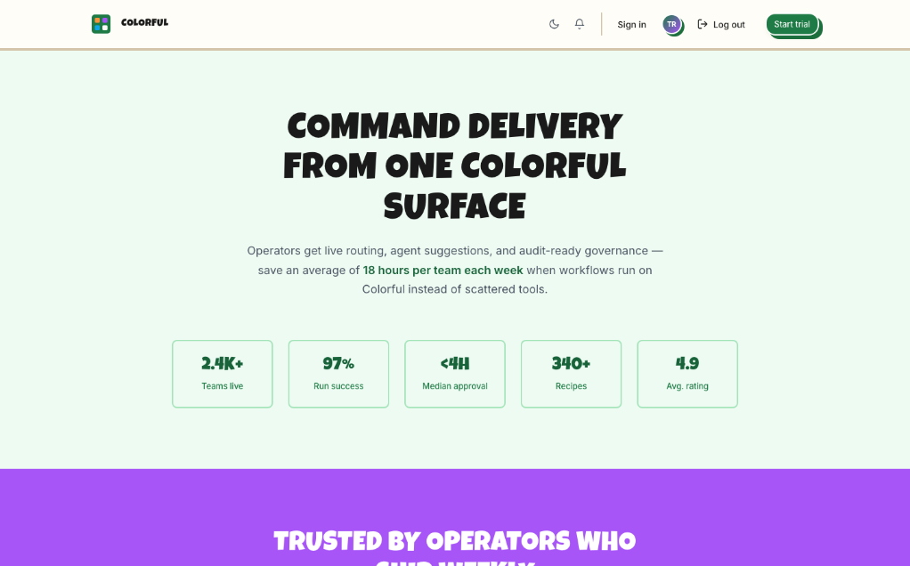</a><br />
      <a href="https://typeui.sh/design-skills/colorful"><b>Colorful</b></a><br />
      <sub><code>npx typeui.sh pull colorful</code></sub>
    </td>
    <td align="center" width="33%" valign="top">
      <a href="https://typeui.sh/design-skills/contemporary">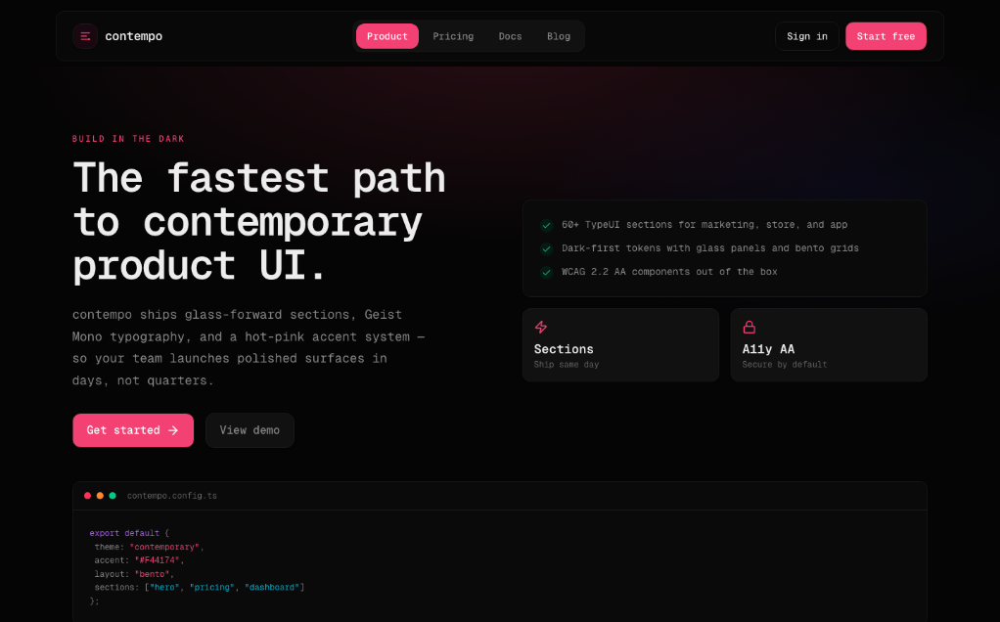</a><br />
      <a href="https://typeui.sh/design-skills/contemporary"><b>Contemporary</b></a><br />
      <sub><code>npx typeui.sh pull contemporary</code></sub>
    </td>
    <td align="center" width="33%" valign="top">
      <a href="https://typeui.sh/design-skills/corporate">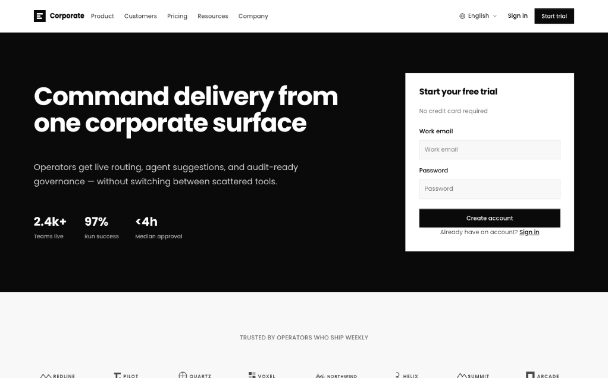</a><br />
      <a href="https://typeui.sh/design-skills/corporate"><b>Corporate</b></a><br />
      <sub><code>npx typeui.sh pull corporate</code></sub>
    </td>
  </tr>
  <tr>
    <td align="center" width="33%" valign="top">
      <a href="https://typeui.sh/design-skills/cosmic">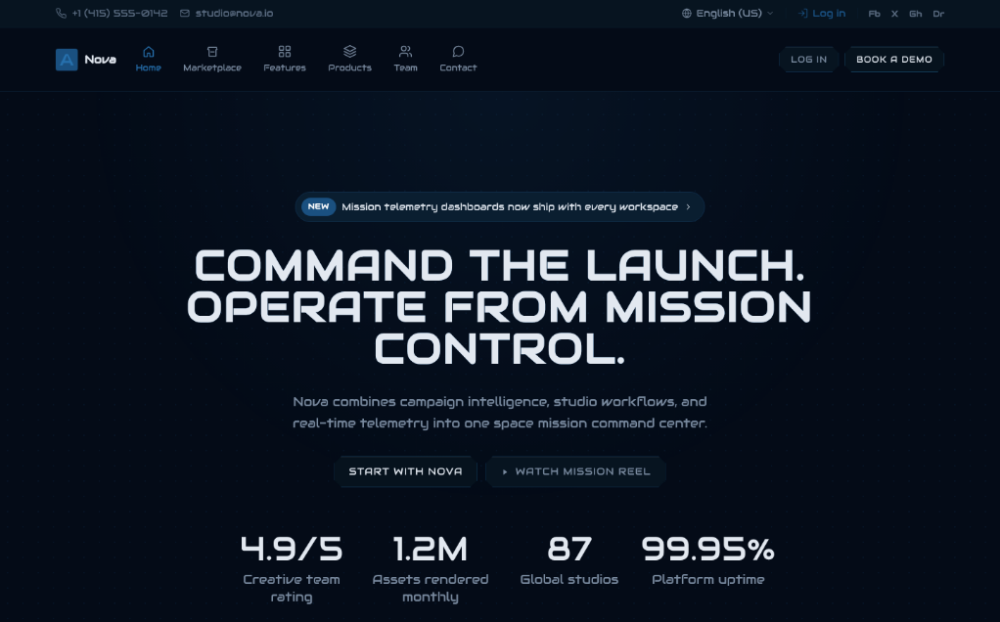</a><br />
      <a href="https://typeui.sh/design-skills/cosmic"><b>Cosmic</b></a><br />
      <sub><code>npx typeui.sh pull cosmic</code></sub>
    </td>
    <td align="center" width="33%" valign="top">
      <a href="https://typeui.sh/design-skills/creative">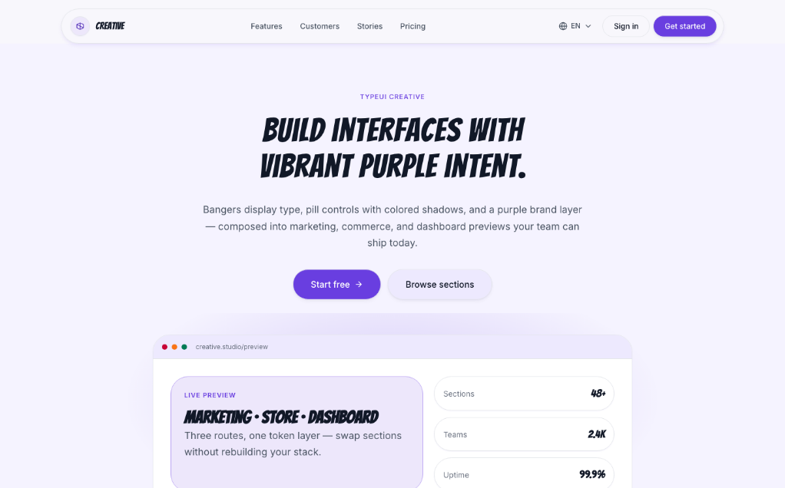</a><br />
      <a href="https://typeui.sh/design-skills/creative"><b>Creative</b></a><br />
      <sub><code>npx typeui.sh pull creative</code></sub>
    </td>
    <td align="center" width="33%" valign="top">
      <a href="https://typeui.sh/design-skills/enterprise">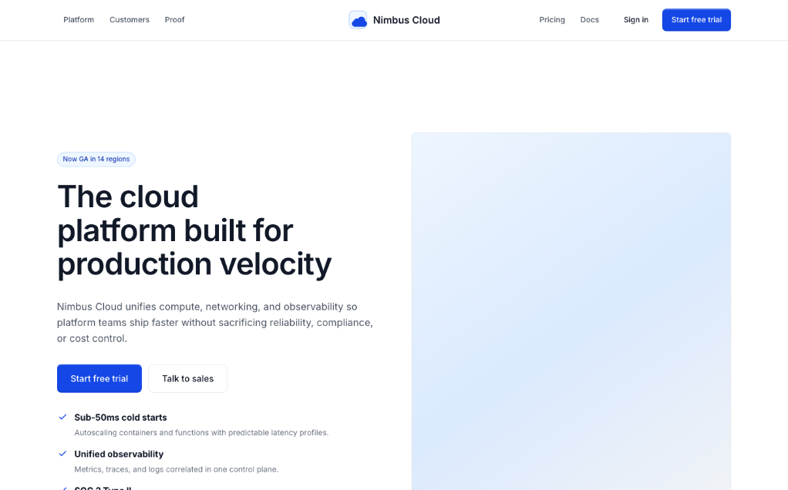</a><br />
      <a href="https://typeui.sh/design-skills/enterprise"><b>Enterprise</b></a><br />
      <sub><code>npx typeui.sh pull enterprise</code></sub>
    </td>
  </tr>
  <tr>
    <td align="center" width="33%" valign="top">
      <a href="https://typeui.sh/design-skills/dithered">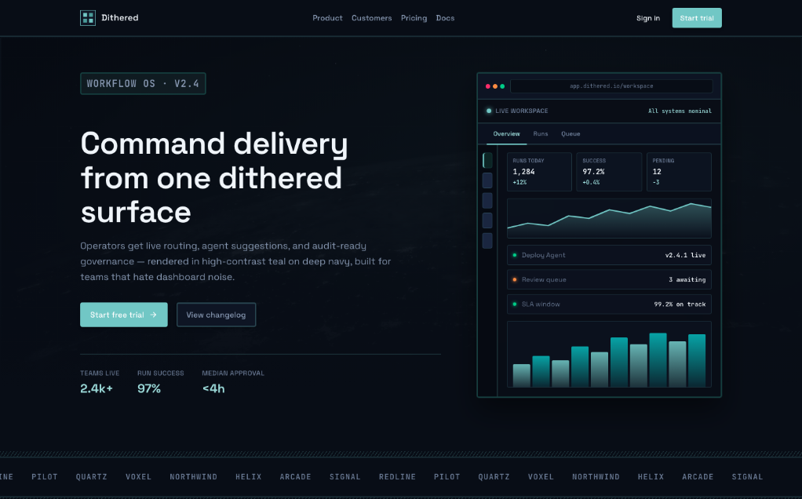</a><br />
      <a href="https://typeui.sh/design-skills/dithered"><b>Dithered</b></a><br />
      <sub><code>npx typeui.sh pull dithered</code></sub>
    </td>
    <td align="center" width="33%" valign="top">
      <a href="https://typeui.sh/design-skills/doodle">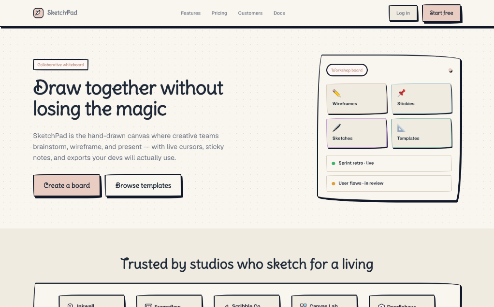</a><br />
      <a href="https://typeui.sh/design-skills/doodle"><b>Doodle</b></a><br />
      <sub><code>npx typeui.sh pull doodle</code></sub>
    </td>
    <td align="center" width="33%" valign="top">
      <a href="https://typeui.sh/design-skills/dramatic">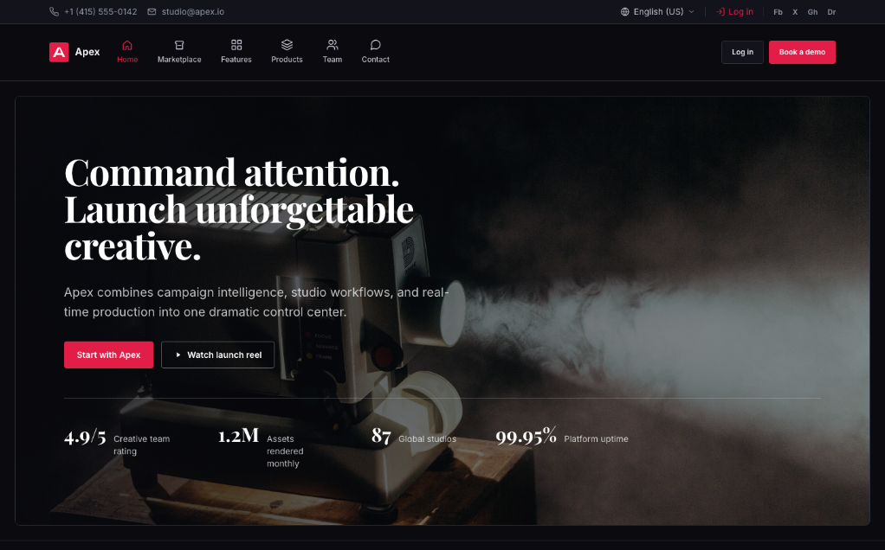</a><br />
      <a href="https://typeui.sh/design-skills/dramatic"><b>Dramatic</b></a><br />
      <sub><code>npx typeui.sh pull dramatic</code></sub>
    </td>
  </tr>
  <tr>
    <td align="center" width="33%" valign="top">
      <a href="https://typeui.sh/design-skills/editorial">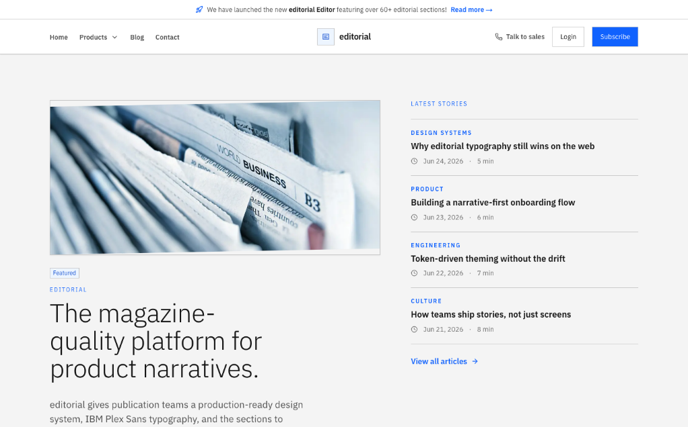</a><br />
      <a href="https://typeui.sh/design-skills/editorial"><b>Editorial</b></a><br />
      <sub><code>npx typeui.sh pull editorial</code></sub>
    </td>
    <td align="center" width="33%" valign="top">
      <a href="https://typeui.sh/design-skills/elegant">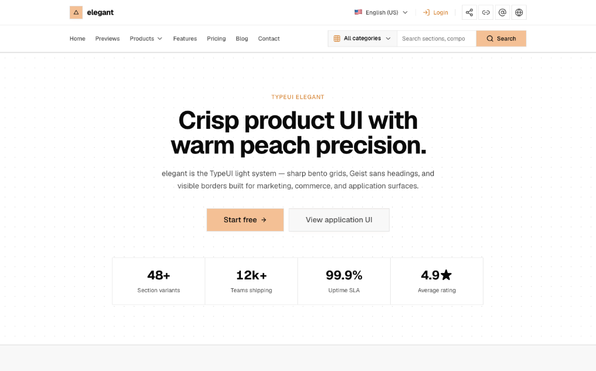</a><br />
      <a href="https://typeui.sh/design-skills/elegant"><b>Elegant</b></a><br />
      <sub><code>npx typeui.sh pull elegant</code></sub>
    </td>
    <td align="center" width="33%" valign="top">
      <a href="https://typeui.sh/design-skills/pulse">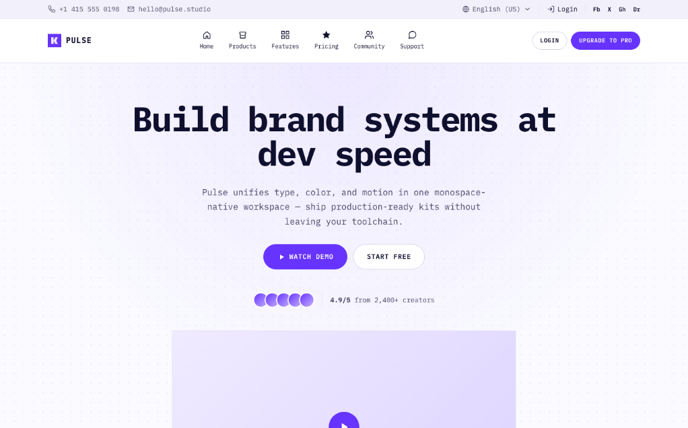</a><br />
      <a href="https://typeui.sh/design-skills/pulse"><b>Pulse</b></a><br />
      <sub><code>npx typeui.sh pull pulse</code></sub>
    </td>
  </tr>
  <tr>
    <td align="center" width="33%" valign="top">
      <a href="https://typeui.sh/design-skills/stitch">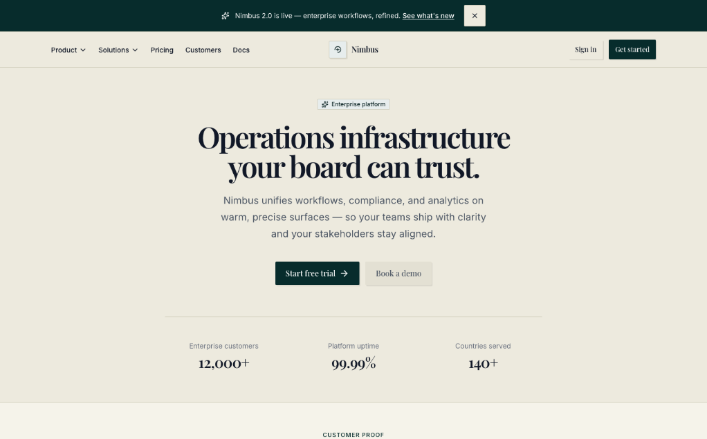</a><br />
      <a href="https://typeui.sh/design-skills/stitch"><b>Stitch</b></a><br />
      <sub><code>npx typeui.sh pull stitch</code></sub>
    </td>
    <td align="center" width="33%" valign="top">
      <a href="https://typeui.sh/design-skills/expressive">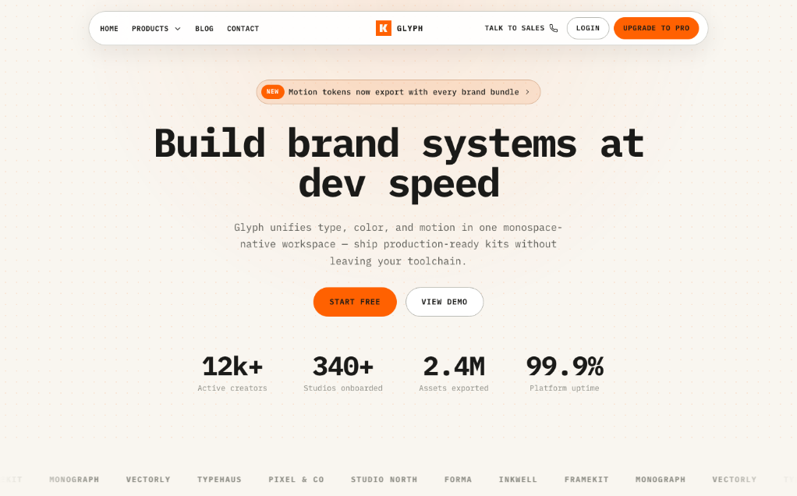</a><br />
      <a href="https://typeui.sh/design-skills/expressive"><b>Expressive</b></a><br />
      <sub><code>npx typeui.sh pull expressive</code></sub>
    </td>
    <td align="center" width="33%" valign="top">
      <a href="https://typeui.sh/design-skills/fantasy">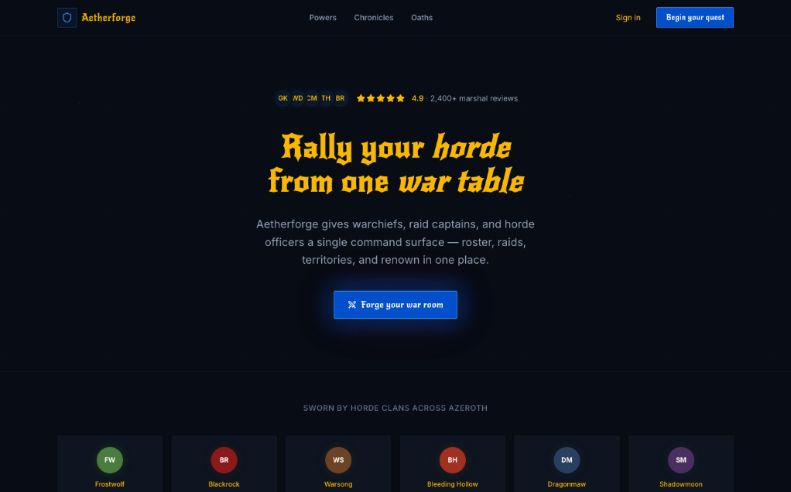</a><br />
      <a href="https://typeui.sh/design-skills/fantasy"><b>Fantasy</b></a><br />
      <sub><code>npx typeui.sh pull fantasy</code></sub>
    </td>
  </tr>
  <tr>
    <td align="center" width="33%" valign="top">
      <a href="https://typeui.sh/design-skills/fiction">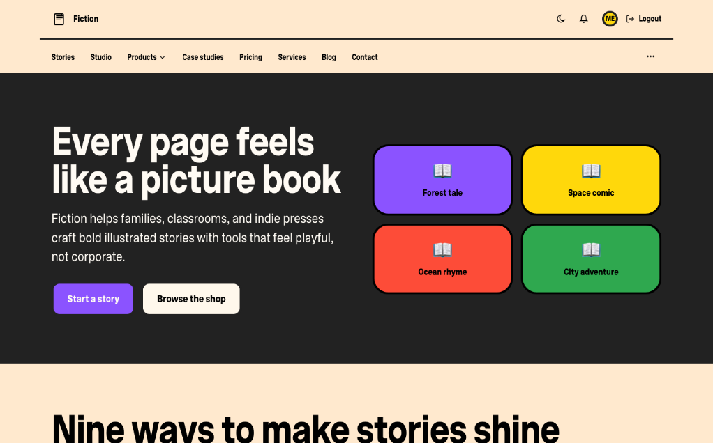</a><br />
      <a href="https://typeui.sh/design-skills/fiction"><b>Fiction</b></a><br />
      <sub><code>npx typeui.sh pull fiction</code></sub>
    </td>
    <td align="center" width="33%" valign="top">
      <a href="https://typeui.sh/design-skills/flat">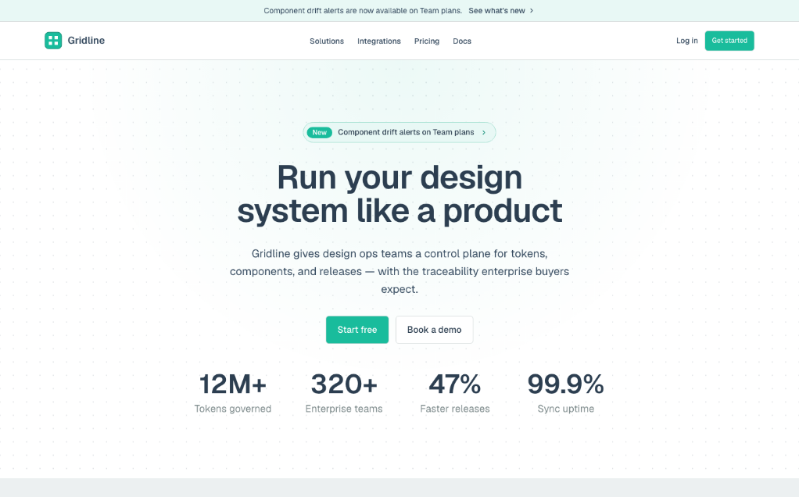</a><br />
      <a href="https://typeui.sh/design-skills/flat"><b>Flat</b></a><br />
      <sub><code>npx typeui.sh pull flat</code></sub>
    </td>
    <td align="center" width="33%" valign="top">
      <a href="https://typeui.sh/design-skills/friendly">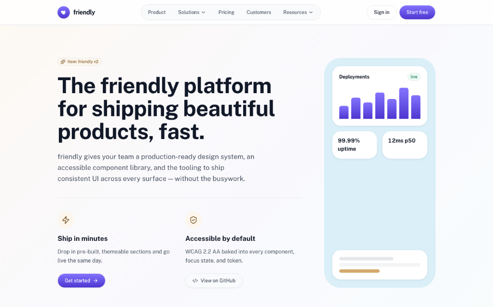</a><br />
      <a href="https://typeui.sh/design-skills/friendly"><b>Friendly</b></a><br />
      <sub><code>npx typeui.sh pull friendly</code></sub>
    </td>
  </tr>
  <tr>
    <td align="center" width="33%" valign="top">
      <a href="https://typeui.sh/design-skills/futuristic">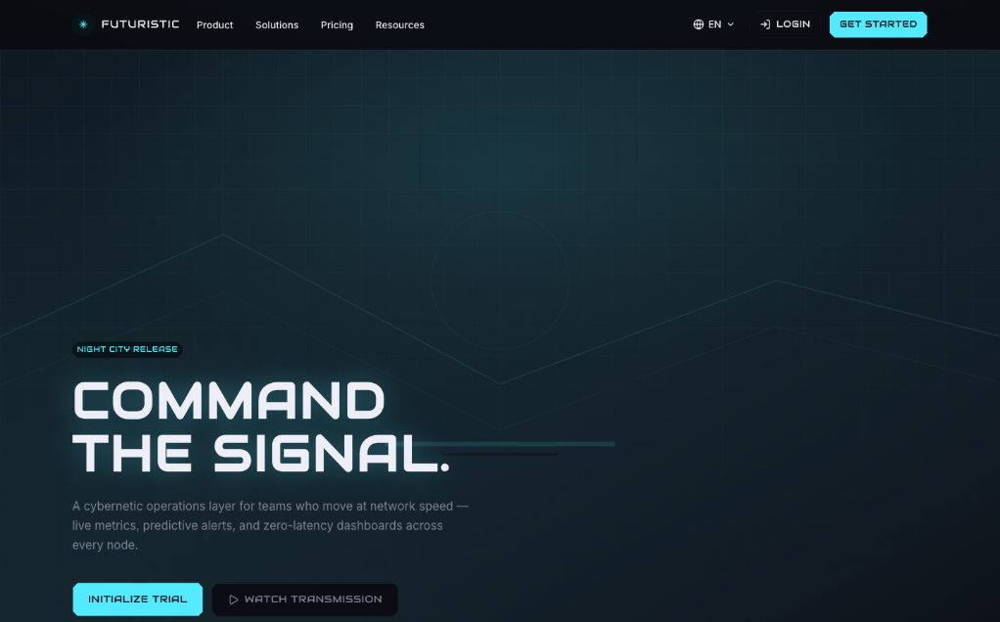</a><br />
      <a href="https://typeui.sh/design-skills/futuristic"><b>Futuristic</b></a><br />
      <sub><code>npx typeui.sh pull futuristic</code></sub>
    </td>
    <td align="center" width="33%" valign="top">
      <a href="https://typeui.sh/design-skills/glassmorphism">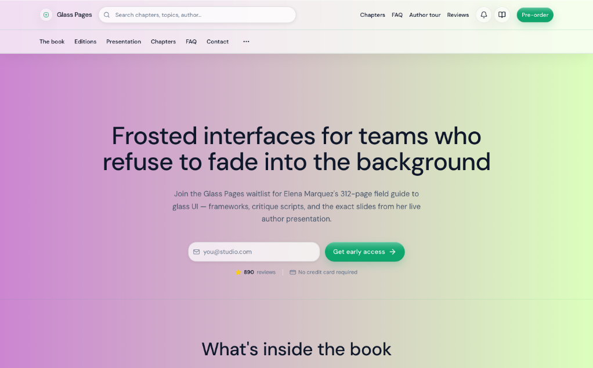</a><br />
      <a href="https://typeui.sh/design-skills/glassmorphism"><b>Glassmorphism</b></a><br />
      <sub><code>npx typeui.sh pull glassmorphism</code></sub>
    </td>
    <td align="center" width="33%" valign="top">
      <a href="https://typeui.sh/design-skills/gradient">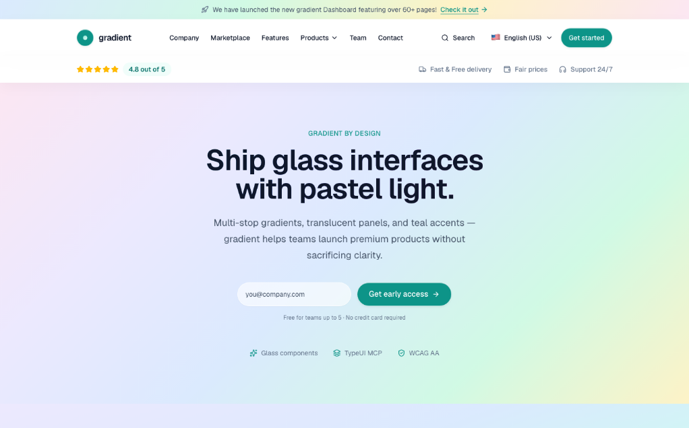</a><br />
      <a href="https://typeui.sh/design-skills/gradient"><b>Gradient</b></a><br />
      <sub><code>npx typeui.sh pull gradient</code></sub>
    </td>
  </tr>
  <tr>
    <td align="center" width="33%" valign="top">
      <a href="https://typeui.sh/design-skills/immersive">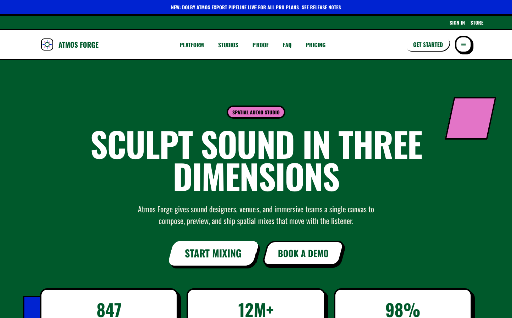</a><br />
      <a href="https://typeui.sh/design-skills/immersive"><b>Immersive</b></a><br />
      <sub><code>npx typeui.sh pull immersive</code></sub>
    </td>
    <td align="center" width="33%" valign="top">
      <a href="https://typeui.sh/design-skills/impeccable">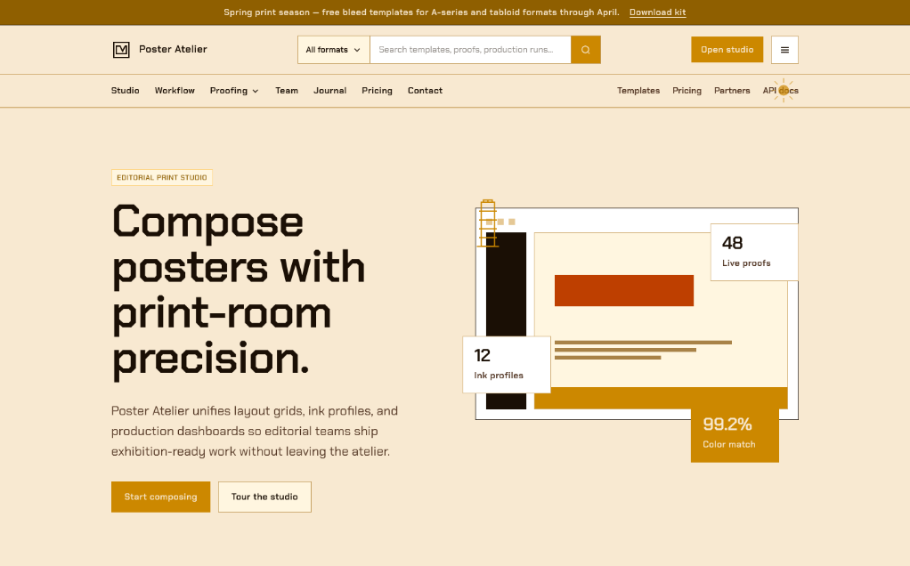</a><br />
      <a href="https://typeui.sh/design-skills/impeccable"><b>Impeccable</b></a><br />
      <sub><code>npx typeui.sh pull impeccable</code></sub>
    </td>
    <td align="center" width="33%" valign="top">
      <a href="https://typeui.sh/design-skills/levels">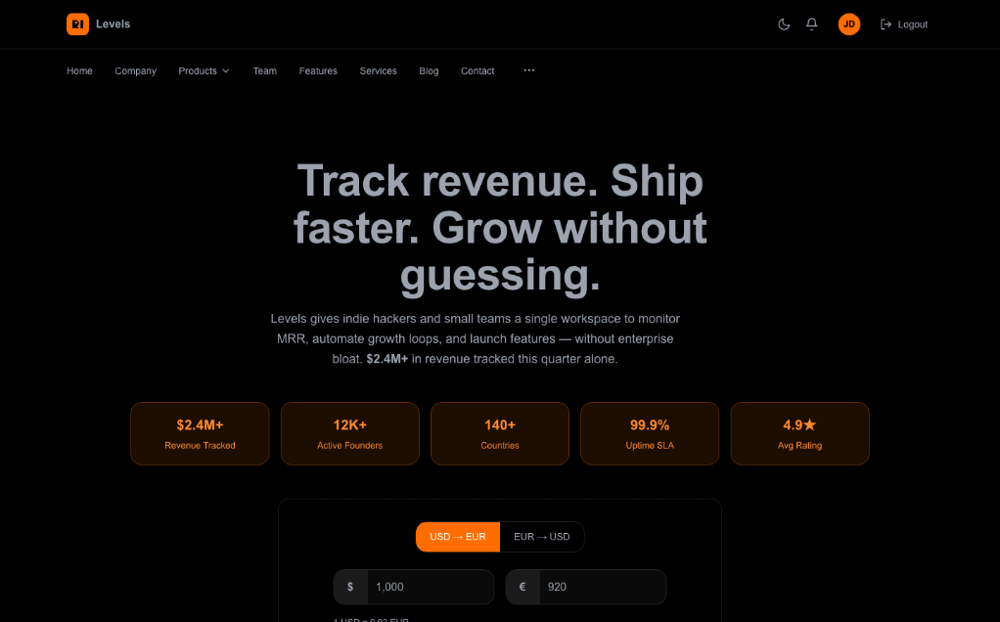</a><br />
      <a href="https://typeui.sh/design-skills/levels"><b>Levels</b></a><br />
      <sub><code>npx typeui.sh pull levels</code></sub>
    </td>
  </tr>
  <tr>
    <td align="center" width="33%" valign="top">
      <a href="https://typeui.sh/design-skills/lingo">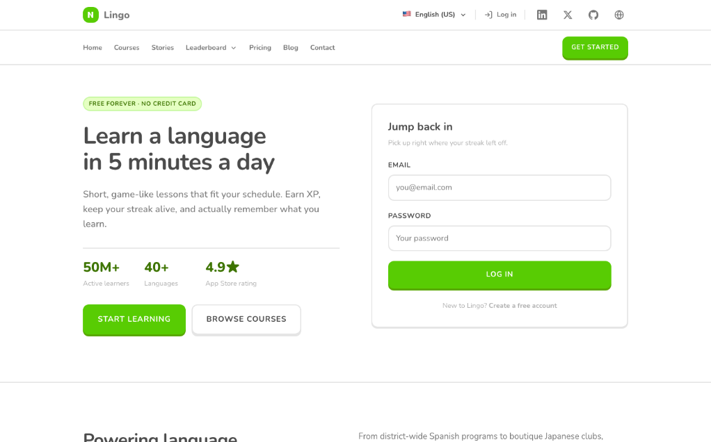</a><br />
      <a href="https://typeui.sh/design-skills/lingo"><b>Lingo</b></a><br />
      <sub><code>npx typeui.sh pull lingo</code></sub>
    </td>
    <td align="center" width="33%" valign="top">
      <a href="https://typeui.sh/design-skills/luxury">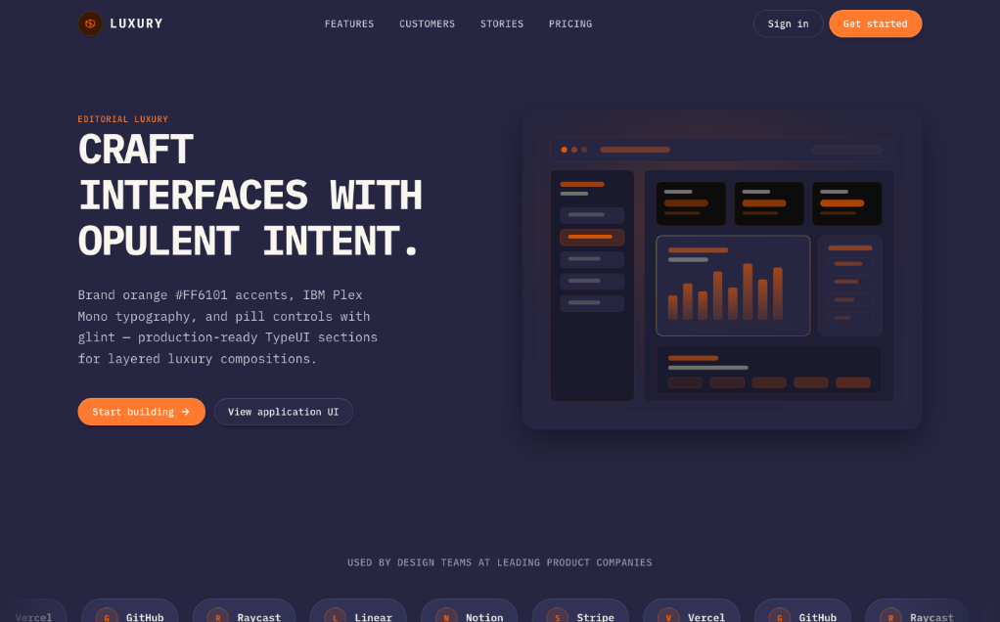</a><br />
      <a href="https://typeui.sh/design-skills/luxury"><b>Luxury</b></a><br />
      <sub><code>npx typeui.sh pull luxury</code></sub>
    </td>
    <td align="center" width="33%" valign="top">
      <a href="https://typeui.sh/design-skills/material">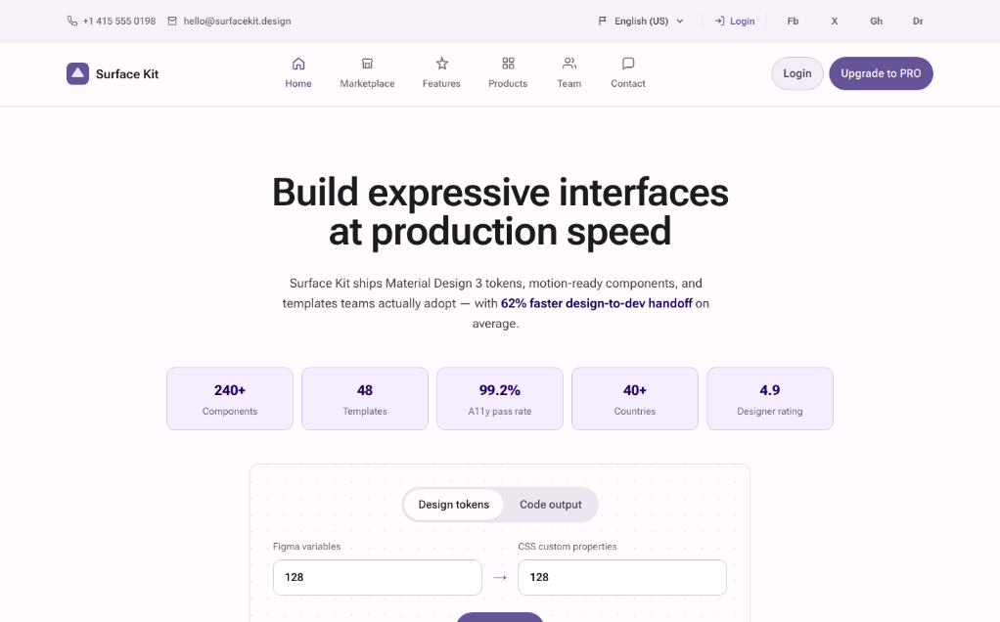</a><br />
      <a href="https://typeui.sh/design-skills/material"><b>Material</b></a><br />
      <sub><code>npx typeui.sh pull material</code></sub>
    </td>
  </tr>
  <tr>
    <td align="center" width="33%" valign="top">
      <a href="https://typeui.sh/design-skills/matrix">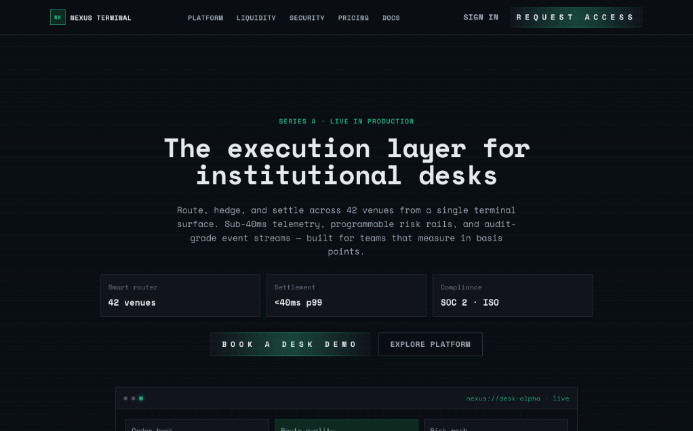</a><br />
      <a href="https://typeui.sh/design-skills/matrix"><b>Matrix</b></a><br />
      <sub><code>npx typeui.sh pull matrix</code></sub>
    </td>
    <td align="center" width="33%" valign="top">
      <a href="https://typeui.sh/design-skills/minimal">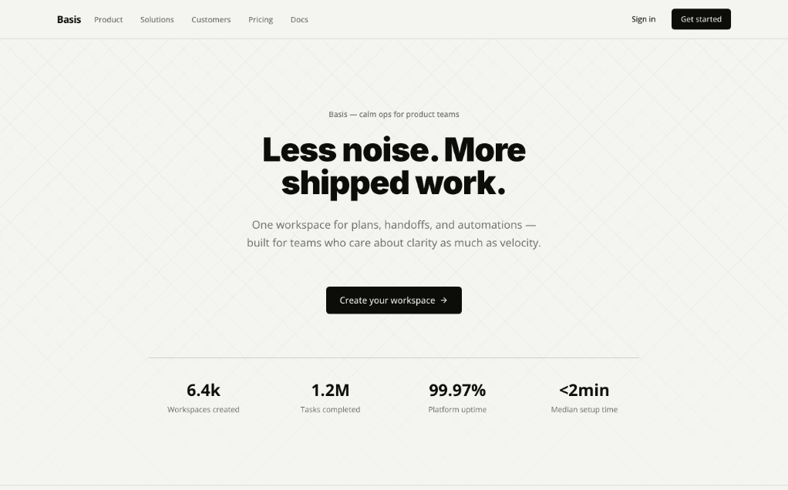</a><br />
      <a href="https://typeui.sh/design-skills/minimal"><b>Minimal</b></a><br />
      <sub><code>npx typeui.sh pull minimal</code></sub>
    </td>
    <td align="center" width="33%" valign="top">
      <a href="https://typeui.sh/design-skills/modern">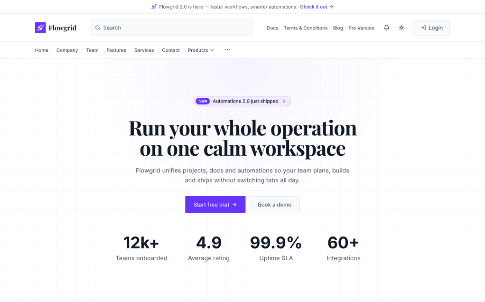</a><br />
      <a href="https://typeui.sh/design-skills/modern"><b>Modern</b></a><br />
      <sub><code>npx typeui.sh pull modern</code></sub>
    </td>
  </tr>
  <tr>
    <td align="center" width="33%" valign="top">
      <a href="https://typeui.sh/design-skills/mono">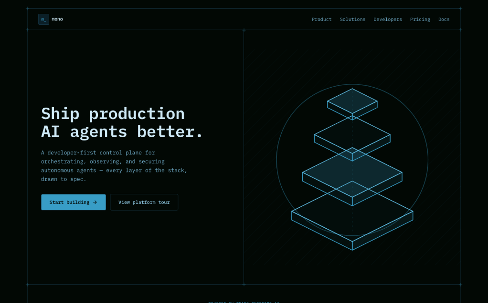</a><br />
      <a href="https://typeui.sh/design-skills/mono"><b>Mono</b></a><br />
      <sub><code>npx typeui.sh pull mono</code></sub>
    </td>
    <td align="center" width="33%" valign="top">
      <a href="https://typeui.sh/design-skills/neon">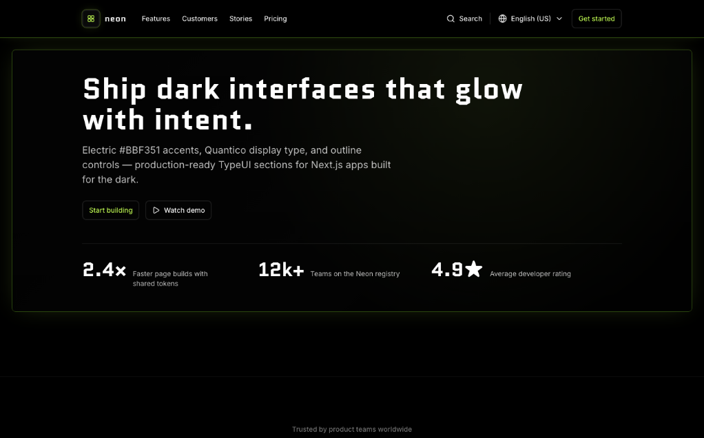</a><br />
      <a href="https://typeui.sh/design-skills/neon"><b>Neon</b></a><br />
      <sub><code>npx typeui.sh pull neon</code></sub>
    </td>
    <td align="center" width="33%" valign="top">
      <a href="https://typeui.sh/design-skills/neobrutalism">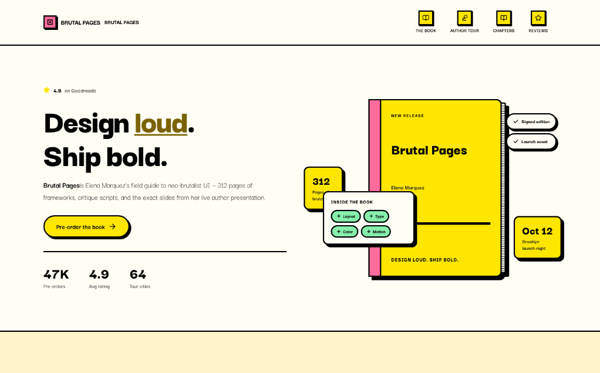</a><br />
      <a href="https://typeui.sh/design-skills/neobrutalism"><b>Neobrutalism</b></a><br />
      <sub><code>npx typeui.sh pull neobrutalism</code></sub>
    </td>
  </tr>
  <tr>
    <td align="center" width="33%" valign="top">
      <a href="https://typeui.sh/design-skills/neumorphism">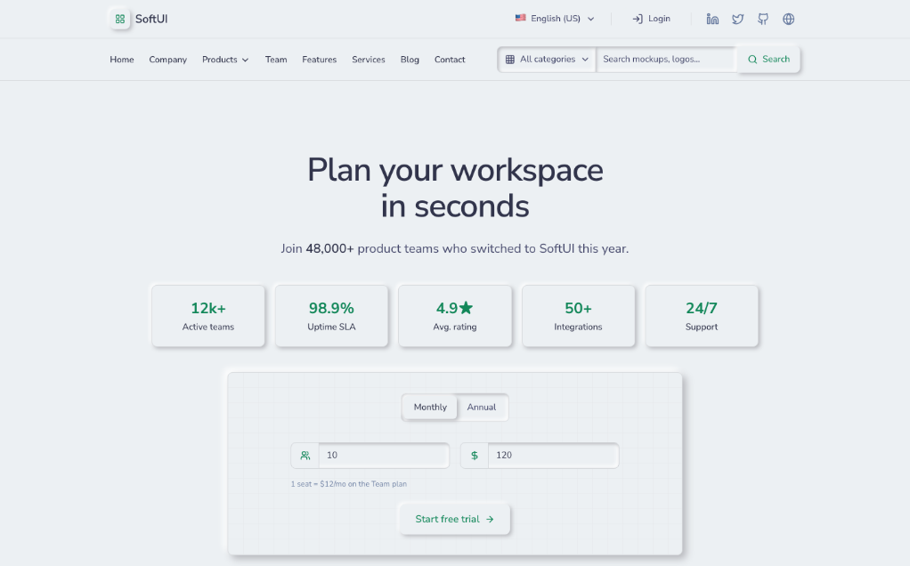</a><br />
      <a href="https://typeui.sh/design-skills/neumorphism"><b>Neumorphism</b></a><br />
      <sub><code>npx typeui.sh pull neumorphism</code></sub>
    </td>
    <td align="center" width="33%" valign="top">
      <a href="https://typeui.sh/design-skills/pacman">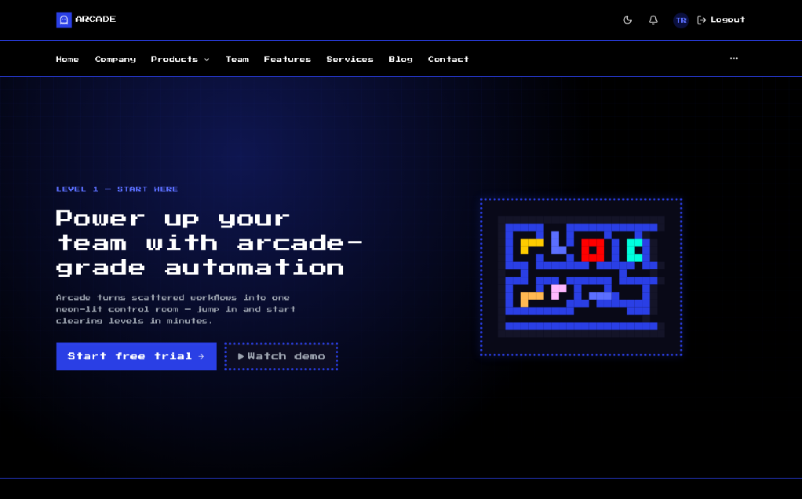</a><br />
      <a href="https://typeui.sh/design-skills/pacman"><b>Pacman</b></a><br />
      <sub><code>npx typeui.sh pull pacman</code></sub>
    </td>
    <td align="center" width="33%" valign="top">
      <a href="https://typeui.sh/design-skills/paper">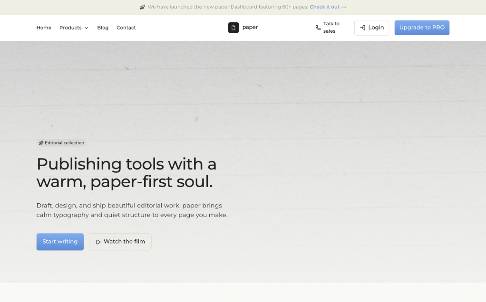</a><br />
      <a href="https://typeui.sh/design-skills/paper"><b>Paper</b></a><br />
      <sub><code>npx typeui.sh pull paper</code></sub>
    </td>
  </tr>
  <tr>
    <td align="center" width="33%" valign="top">
      <a href="https://typeui.sh/design-skills/perspective">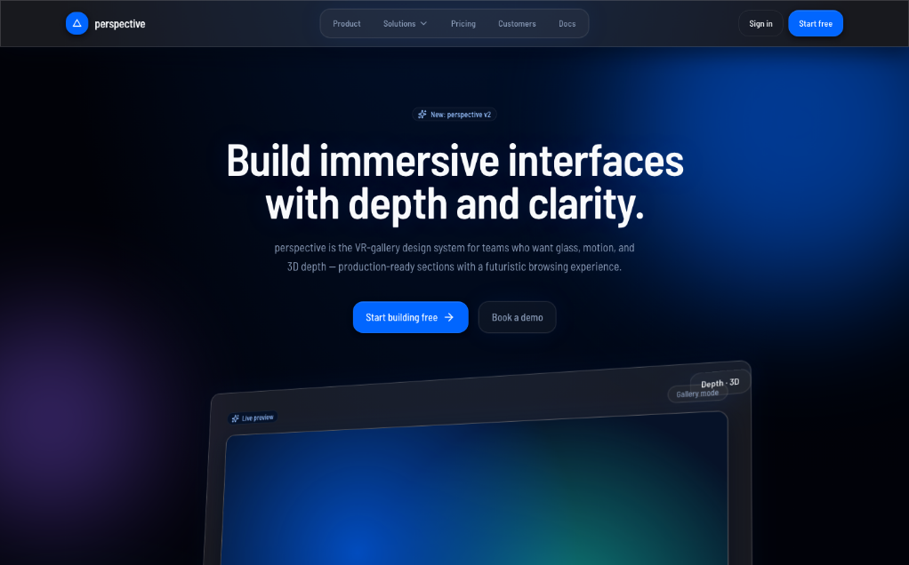</a><br />
      <a href="https://typeui.sh/design-skills/perspective"><b>Perspective</b></a><br />
      <sub><code>npx typeui.sh pull perspective</code></sub>
    </td>
    <td align="center" width="33%" valign="top">
      <a href="https://typeui.sh/design-skills/premium">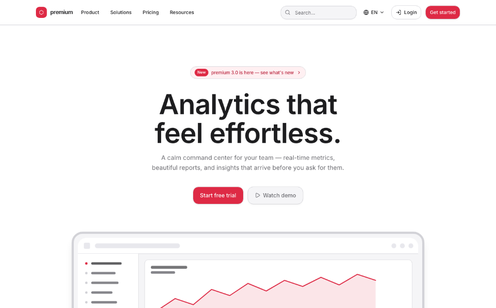</a><br />
      <a href="https://typeui.sh/design-skills/premium"><b>Premium</b></a><br />
      <sub><code>npx typeui.sh pull premium</code></sub>
    </td>
    <td align="center" width="33%" valign="top">
      <a href="https://typeui.sh/design-skills/professional">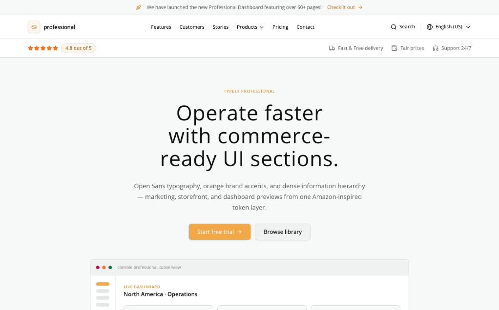</a><br />
      <a href="https://typeui.sh/design-skills/professional"><b>Professional</b></a><br />
      <sub><code>npx typeui.sh pull professional</code></sub>
    </td>
  </tr>
  <tr>
    <td align="center" width="33%" valign="top">
      <a href="https://typeui.sh/design-skills/basic"></a><br />
      <a href="https://typeui.sh/design-skills/basic"><b>Basic</b></a><br />
      <sub><code>npx typeui.sh pull basic</code></sub>
    </td>
    <td align="center" width="33%" valign="top">
      <a href="https://typeui.sh/design-skills/refined">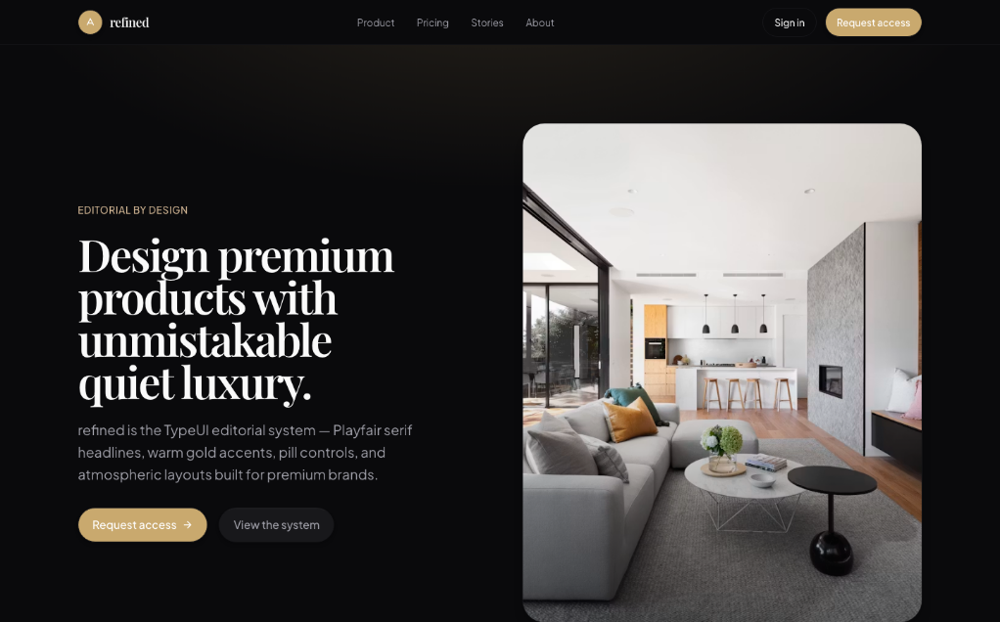</a><br />
      <a href="https://typeui.sh/design-skills/refined"><b>Refined</b></a><br />
      <sub><code>npx typeui.sh pull refined</code></sub>
    </td>
    <td align="center" width="33%" valign="top">
      <a href="https://typeui.sh/design-skills/retro">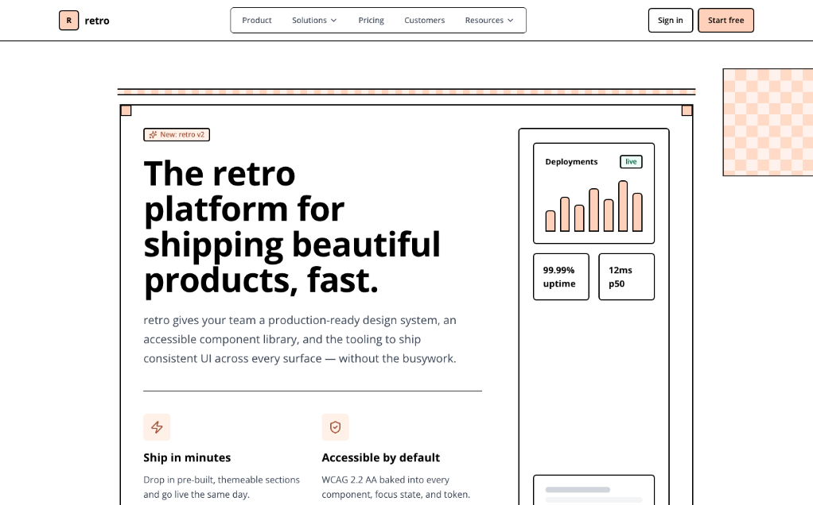</a><br />
      <a href="https://typeui.sh/design-skills/retro"><b>Retro</b></a><br />
      <sub><code>npx typeui.sh pull retro</code></sub>
    </td>
  </tr>
  <tr>
    <td align="center" width="33%" valign="top">
      <a href="https://typeui.sh/design-skills/riso">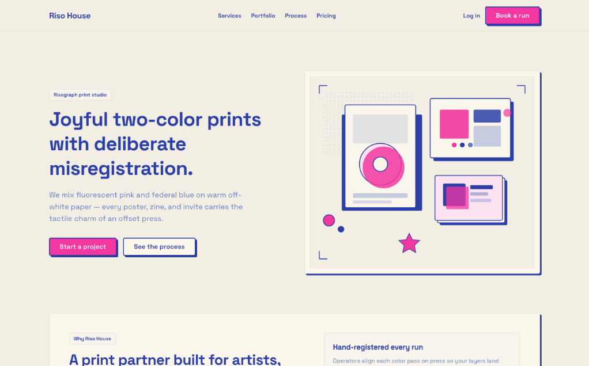</a><br />
      <a href="https://typeui.sh/design-skills/riso"><b>Riso</b></a><br />
      <sub><code>npx typeui.sh pull riso</code></sub>
    </td>
    <td align="center" width="33%" valign="top">
      <a href="https://typeui.sh/design-skills/sega">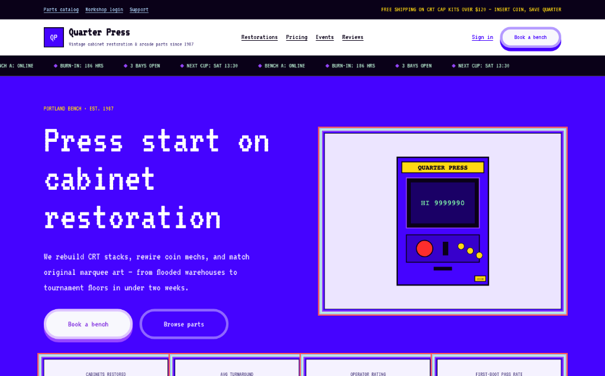</a><br />
      <a href="https://typeui.sh/design-skills/sega"><b>Sega</b></a><br />
      <sub><code>npx typeui.sh pull sega</code></sub>
    </td>
    <td align="center" width="33%" valign="top">
      <a href="https://typeui.sh/design-skills/shadcn">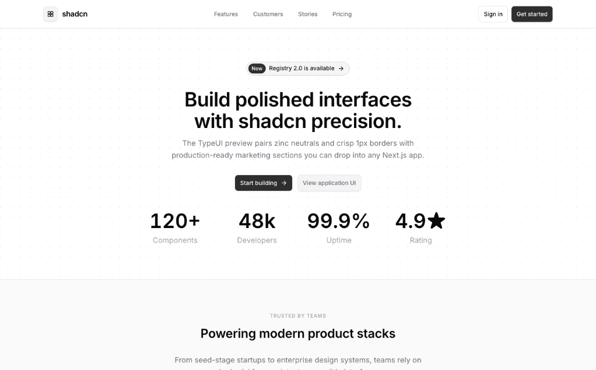</a><br />
      <a href="https://typeui.sh/design-skills/shadcn"><b>Shadcn</b></a><br />
      <sub><code>npx typeui.sh pull shadcn</code></sub>
    </td>
  </tr>
  <tr>
    <td align="center" width="33%" valign="top">
      <a href="https://typeui.sh/design-skills/simple"></a><br />
      <a href="https://typeui.sh/design-skills/simple"><b>Simple</b></a><br />
      <sub><code>npx typeui.sh pull simple</code></sub>
    </td>
    <td align="center" width="33%" valign="top">
      <a href="https://typeui.sh/design-skills/sketch">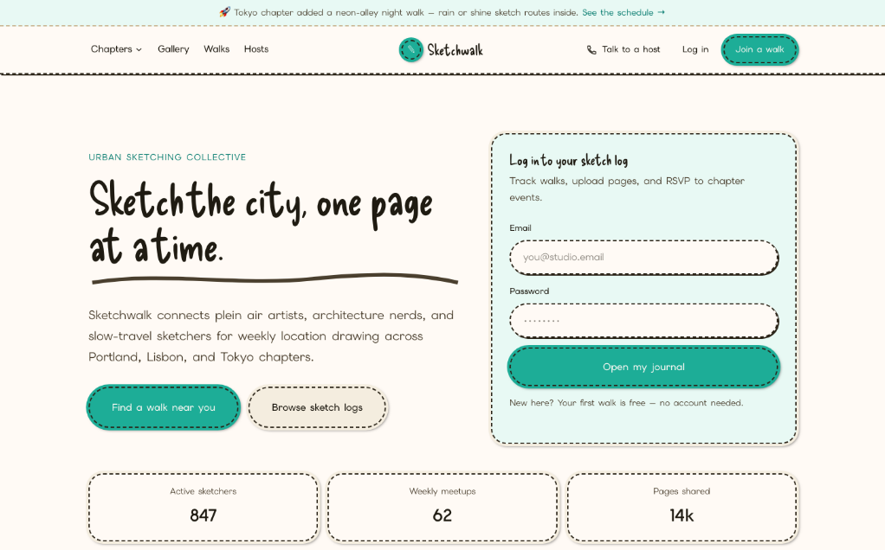</a><br />
      <a href="https://typeui.sh/design-skills/sketch"><b>Sketch</b></a><br />
      <sub><code>npx typeui.sh pull sketch</code></sub>
    </td>
    <td align="center" width="33%" valign="top">
      <a href="https://typeui.sh/design-skills/skeumorphism">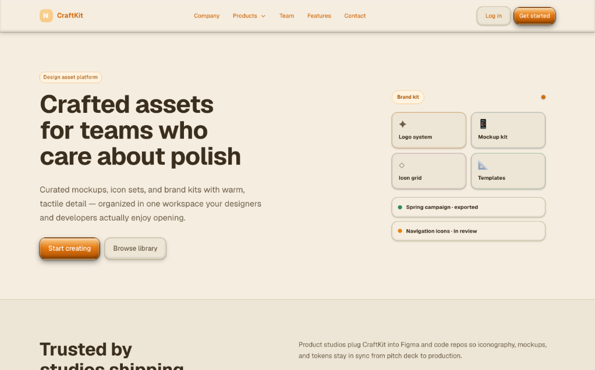</a><br />
      <a href="https://typeui.sh/design-skills/skeumorphism"><b>Skeumorphism</b></a><br />
      <sub><code>npx typeui.sh pull skeumorphism</code></sub>
    </td>
  </tr>
  <tr>
    <td align="center" width="33%" valign="top">
      <a href="https://typeui.sh/design-skills/sleek">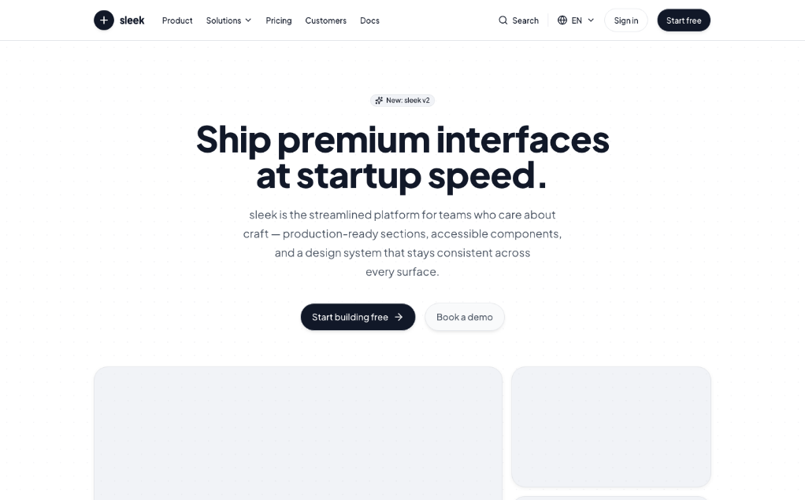</a><br />
      <a href="https://typeui.sh/design-skills/sleek"><b>Sleek</b></a><br />
      <sub><code>npx typeui.sh pull sleek</code></sub>
    </td>
    <td align="center" width="33%" valign="top">
      <a href="https://typeui.sh/design-skills/spacious">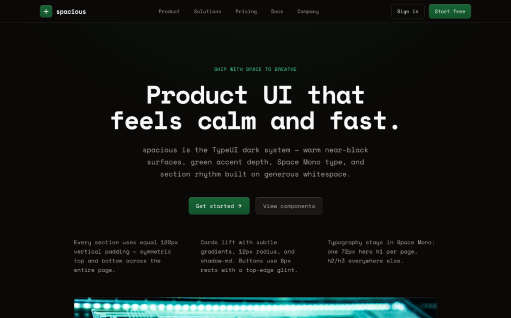</a><br />
      <a href="https://typeui.sh/design-skills/spacious"><b>Spacious</b></a><br />
      <sub><code>npx typeui.sh pull spacious</code></sub>
    </td>
    <td align="center" width="33%" valign="top">
      <a href="https://typeui.sh/design-skills/storytelling">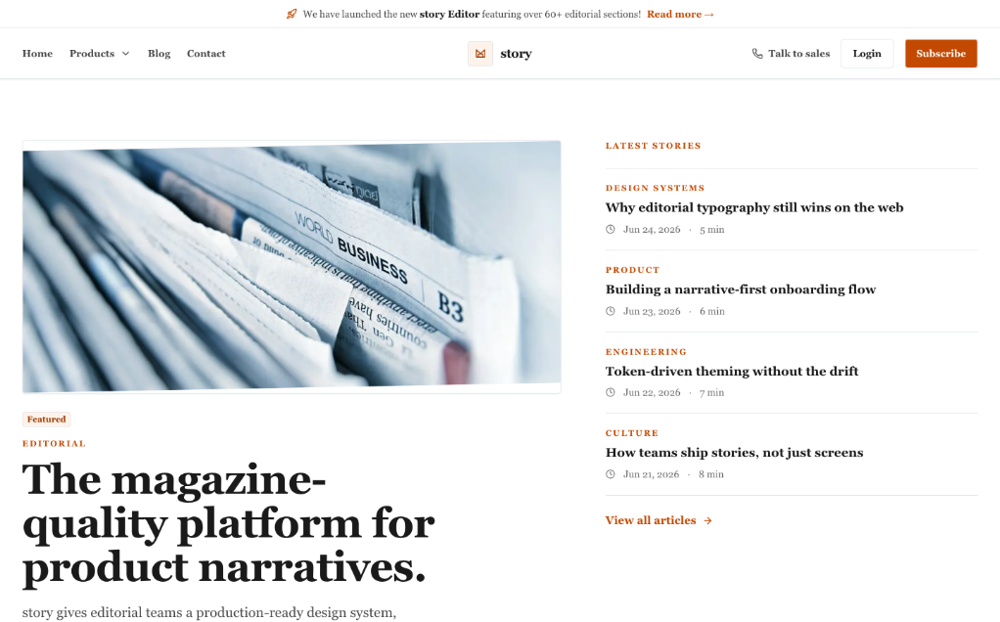</a><br />
      <a href="https://typeui.sh/design-skills/storytelling"><b>Storytelling</b></a><br />
      <sub><code>npx typeui.sh pull storytelling</code></sub>
    </td>
  </tr>
  <tr>
    <td align="center" width="33%" valign="top">
      <a href="https://typeui.sh/design-skills/terracotta">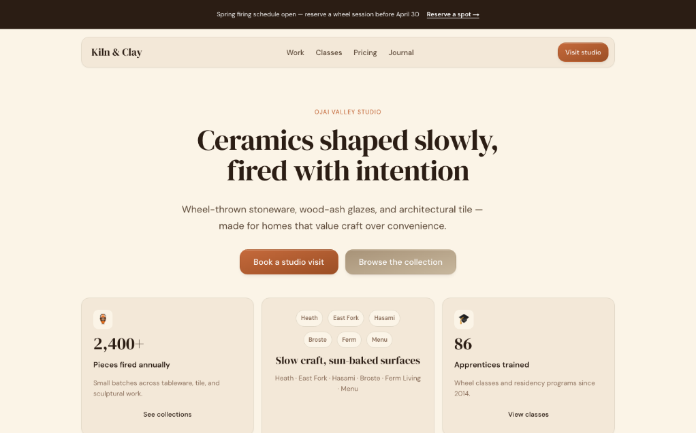</a><br />
      <a href="https://typeui.sh/design-skills/terracotta"><b>Terracotta</b></a><br />
      <sub><code>npx typeui.sh pull terracotta</code></sub>
    </td>
    <td align="center" width="33%" valign="top">
      <a href="https://typeui.sh/design-skills/tetris">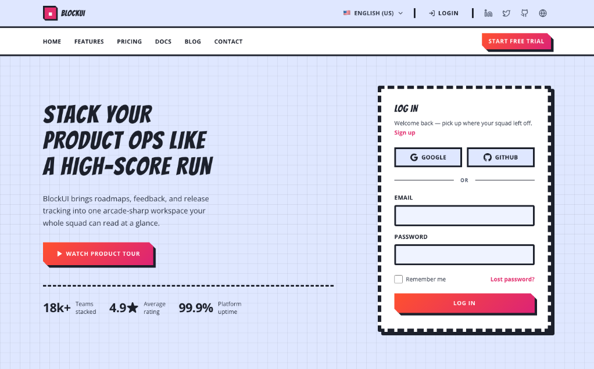</a><br />
      <a href="https://typeui.sh/design-skills/tetris"><b>Tetris</b></a><br />
      <sub><code>npx typeui.sh pull tetris</code></sub>
    </td>
    <td align="center" width="33%" valign="top">
      <a href="https://typeui.sh/design-skills/vibrant">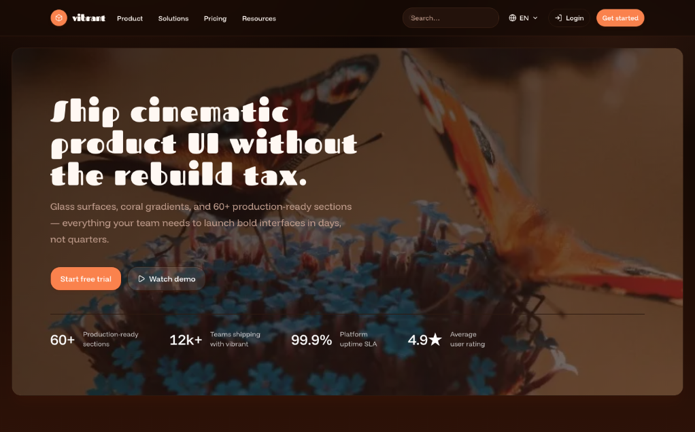</a><br />
      <a href="https://typeui.sh/design-skills/vibrant"><b>Vibrant</b></a><br />
      <sub><code>npx typeui.sh pull vibrant</code></sub>
    </td>
  </tr>
  <tr>
    <td align="center" width="33%" valign="top">
      <a href="https://typeui.sh/design-skills/vintage">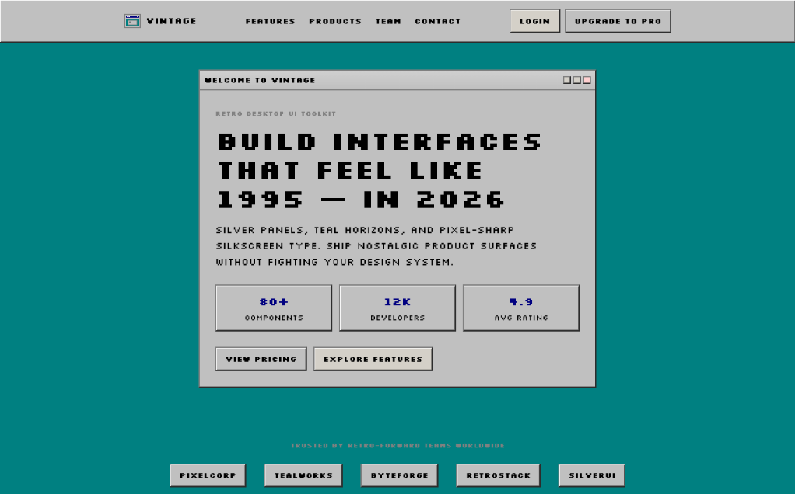</a><br />
      <a href="https://typeui.sh/design-skills/vintage"><b>Vintage</b></a><br />
      <sub><code>npx typeui.sh pull vintage</code></sub>
    </td>
    <td align="center" width="33%"></td>
    <td align="center" width="33%"></td>
  </tr>
</table>

## Usage

### Pull a skill into your project

Use the [typeui.sh CLI](https://github.com/bergside/typeui.sh) to pull any skill by its slug:

```bash
npx typeui.sh pull <slug>
```

The CLI will fetch the `SKILL.md` file from this registry and write it to your configured provider paths (e.g., `.cursor/skills/`, `.claude/`, etc.). The companion `DESIGN.md` remains in this repo alongside each skill for reference and maintenance.

### Specify providers

Target specific agentic tools when pulling:

```bash
npx typeui.sh pull glassmorphism -p cursor,claude
```

### Preview before writing

Use `--dry-run` to see what would be written without making changes:

```bash
npx typeui.sh pull glassmorphism --dry-run
```

### Browse and pull interactively

List all available skills with preview links, then pull one:

```bash
npx typeui.sh list
```

### Generate a custom skill

Run the interactive prompts to create your own design system skill:

```bash
npx typeui.sh generate
```

## Registry Structure

Each skill lives in its own folder under `skills/`:

```
skills/
├── index.json          # Slug-keyed map for fast CLI lookups
├── glassmorphism/
│   ├── SKILL.md        # AI-agent instruction file
│   └── DESIGN.md       # Human-readable design companion
├── brutalism/
│   ├── SKILL.md
│   └── DESIGN.md
├── minimal/
│   ├── SKILL.md
│   └── DESIGN.md
└── ...
```

The `index.json` file maps each slug to its skill path:

```json
{
  "glassmorphism": {
    "slug": "glassmorphism",
    "name": "Glassmorphism",
    "skillPath": "skills/glassmorphism/SKILL.md"
  }
}
```

When you run `npx typeui.sh pull <slug>`, the CLI reads this index, resolves the skill path, and fetches the corresponding `SKILL.md` file. `DESIGN.md` is stored next to each skill for human-facing documentation.

## Contributing

Contributions are welcome! If you'd like to add a new design skill to the registry:

1. Create a new folder under `skills/` with your slug name
2. Add a `SKILL.md` file following the existing format
3. Add a companion `DESIGN.md` file in the same folder
4. Add an entry to `skills/index.json`
5. Submit a pull request

Please ensure your skill file includes all required sections: mission, brand, style foundations, component families, accessibility rules, writing tone, do/don't rules, and quality gates.

## License

[MIT License](LICENSE) &copy; Built and maintained by [Bergside](https://github.com/bergside).

## Sponsors

A huge thank you to the companies supporting our open-source work.

<table width="100%">
  <tr>
    <td align="center" width="33%">
      <a href="https://www.skybridge.tech/?ref=typeui.sh" target="_blank" rel="noopener noreferrer">
        
        <br /><b>Skybridge</b>
      </a>
    </td>
  </tr>
</table>

Want to see your logo here? [Become a sponsor](https://www.typeui.sh/sponsor).
